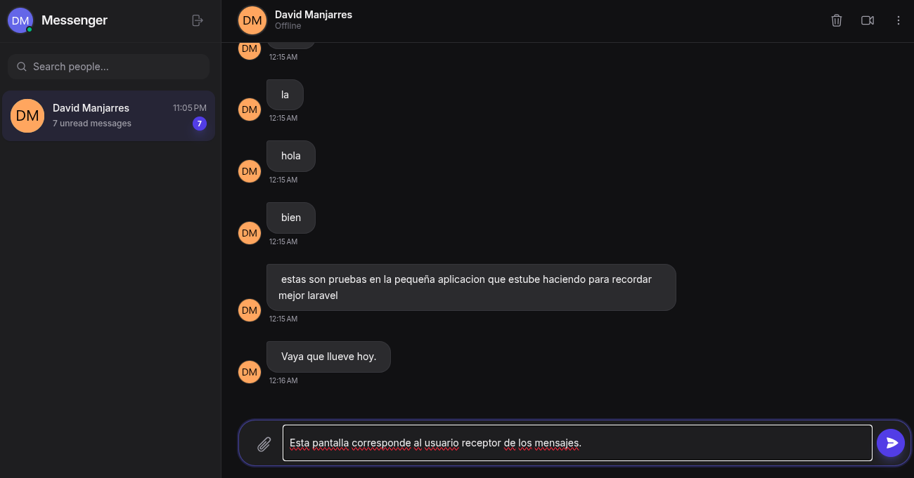
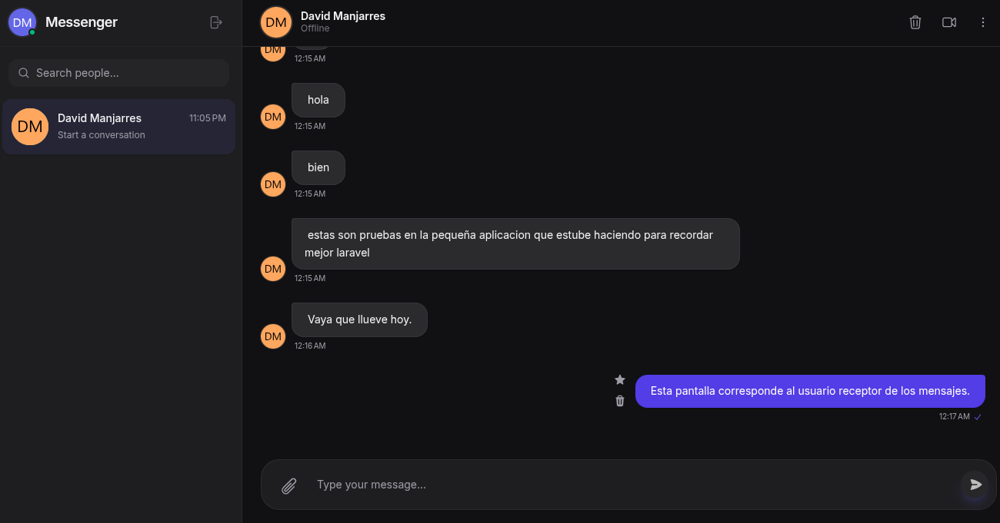

# Nexus Messenger - Enterprise Edition



> **A next-generation real-time messaging platform engineered for performance, scalability, and seamless user experience.**

Nexus Messenger is a full-stack enterprise communication solution that bridges the gap between modern design and robust backend architecture. Built with the bleeding-edge **Angular 21** and **Laravel 12**, it delivers sub-millisecond real-time interactions via native WebSockets.

---

## 🛠️ Tech Stack & Tools

We utilize a cutting-edge technology stack to ensure scalability, security, and developer productivity.

### **Frontend (Client)**
*   **Framework**: [Angular 21](https://angular.io/) - Utilizing the latest Signals-based reactive architecture.
*   **Styling**: [Tailwind CSS v4](https://tailwindcss.com/) - High-performance utility-first CSS utilizing the new engine.
*   **Real-time Client**: `laravel-echo` + `pusher-js` - For seamless WebSocket event listening.
*   **State Management**: RxJS + Angular Signals.
*   **Testing**: [Vitest](https://vitest.dev/) - Blazing fast unit testing.

### **Backend (API)**
*   **Core Framework**: [Laravel 12](https://laravel.com/) - The PHP framework for web artisans.
*   **Real-time Server**: [Laravel Reverb](https://laravel.com/docs/reverb) - First-party WebSocket server for extreme operational scale.
*   **Authentication**: [JWT Auth](https://github.com/PHP-Open-Source-Saver/jwt-auth) - Stateless, secure token-based authentication.
*   **Testing**: [Pest PHP](https://pestphp.com/) - Elegant testing framework.
*   **Code Quality**: Laravel Pint (Style) & Laravel Pail (Logs).

### **Infrastructure & DevOps**
*   **Containerization**: Docker & Docker Compose.
*   **Web Server**: Nginx (Production-ready configuration).
*   **Database**: PostgreSQL - Reliable, ACID-compliant relational data storage.
*   **Asset Bundling**: Vite - Next-generation frontend tooling.

---

## ✨ Key Features

Nexus isn't just a chat app; it's a complete communication suite.

*   **⚡ Instant Messaging**: Native WebSocket integration creates a "live" feel with zero latency.
*   **👥 Group Implementation**: Robust many-to-many relationship handling for scalable group chats.
*   **📁 Enterprise File Sharing**: Drag-and-drop uploads for images and documents with glassmorphic previews.
*   **🔐 Military-Grade Auth**: Full JWT implementation with intercepted HTTP requests and auto-refresh mechanisms.
*   **🧠 Smart UI/UX**:
    *   **Auto-Scroll**: Intelligent viewport management keeps you in the conversation.
    *   **Micro-Interactions**: Smooth transitions and hover effects using vanilla CSS & Tailwind.
    *   **Dark Mode**: A deeply integrated, eye-friendly dark theme.

---

## 🏗️ Architecture Overview

The system follows a **Service-Oriented Architecture (SOA)** approach:

1.  **Client Layer**: Angular SPA serving as the presentation layer, consuming REST APIs and listening to WebSocket channels.
2.  **API Layer**: Laravel REST API handling business logic, validation, and persistence.
3.  **Real-time Layer**: Laravel Reverb server broadcasting events (Messages, Presence, Typing) directly to clients.
4.  **Data Layer**: PostgreSQL storing relational data (Users, Conversations, Messages, Attachments).

---

## 🚀 Getting Started

### Prerequisites
*   **Docker Desktop** (Recommended)
*   *Or for manual runs:* PHP 8.2+, Node.js 20+, PostgreSQL 16+

### 🐳 Quick Start (Docker)

Get the entire stack running in under 2 minutes.

```bash
# 1. Clone the repository
git clone https://github.com/yourusername/messenger.git
cd messenger

# 2. Start services (Background mode)
docker-compose up -d --build

# 3. Initialize Backend (First time only)
docker-compose exec backend composer install
docker-compose exec backend php artisan migrate --seed
docker-compose exec backend php artisan jwt:secret
```

Access the application:
*   **Frontend**: `http://localhost:4200`
*   **Backend API**: `http://localhost:8000`
*   **Reverb Console**: `http://localhost:8080`

### 🔧 Manual Development Setup

If you prefer running services locally on metal:

**Backend:**
```bash
cd backend
composer install
cp .env.example .env
# Update .env with your local DB credentials
php artisan key:generate
php artisan migrate
php artisan serve:all # Runs API + Reverb + Queue
```

**Frontend:**
```bash
cd frontend
npm install
npm start # Runs on port 4200
```

---

## 📸 Visual Tour

| **Zero State** | **Active Conversation** |
|:---:|:---:|
|  |  |
| *Clean, distraction-free startup* | *Responsive mobile layout with attachments* |

---

## 📜 License

This project is open-sourced software licensed under the [MIT license](https://opensource.org/licenses/MIT).
